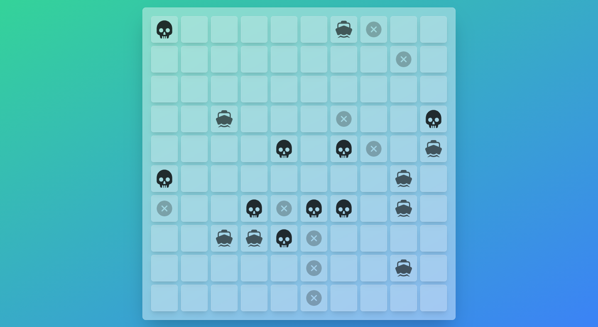

# Battleships

Spis treści

<ol>
		<li><a href="#cel-zadania">Cel Zadania</a></li>
		<li><a href="#backend">Backend</a></li>
	<ul>
		<li><a href="#zasady-gry">Zasady gry</a></li>
		<li><a href="#przyjęte-założenia">Przyjęte założenia</a></li>
		<li><a href="#gracze">Gracze</a></li>
		<li><a href="#arbiter">Arbiter</a></li>
		<li><a href="#statek">Statek</a></li>
		<li><a href="#plansza">Plansza</a></li>
	</ul>
		<li><a href="#frontend">Frontend</a></li>
</ol>

## Cel zadania

Bazując na zasadach gry **Battleships**, zaimplementuj program, który losowo umieszcza statki na dwóch planszach i symulucje rozgrywkę między dwoma graczami.

# Backend
## Zasady gry

* Każdy z graczy posiada 5 statków o kolejnych długościach: **5, 4, 3, 3, 2.**
*  Statki umieszczane są na planszach o rozmiarze **10 x 10** kratek.
*  Statki położone mogą być w kierunku poziomym bądź pionowym - bez skosów.
*  Statki nie mogą się pokrywać, ale mogą być umieszczone obok siebie.
*  Po przyjęciu początkowych pozycji gracze naprzemiennie ogłaszają w którą kratkę oponenta strzelają. Oponent ma obowiązek ogłosić rezultat strzału: **Hit, Miss, Sunk**.
*  Statek zostaje zatopionym w momencie, gdy trafione zostaną jego wszystkie kratki, które okupuje.
*  Wygrywa ten gracz, który jako pierwszy zniszczy wszystkie statki przeciwnika.
*  Każdy z graczy ma do dyspozycji dwie plansze - własną oraz tzw. "firing board", gdzie zapisuje wyniki strzałów w przeciwnika.

## Przyjęte założenia

Dodatkowo do podstawowych zasad gry rozwinięto program o nastepujące założenia:

* Zaimplementowano interfejs **IPlayer**, który umożliwia tworzenie nowych graczy wraz z ich AI (Więcej informacji w sekcji Gracze).
* Każdy z graczy uczestniczy w turnieju w stylu [Double Round Robin](http://www.oxfordcroquet.com/manage/doubleroundrobin/index.asp) - ze względu na przewagę pierwszego ruchu, każdy z graczy walczy z oponentnem dwukrotnie, gdzie raz atakuje, a raz broni jako pierwszy.
* Jeden mecz składa się z **1000** rund - runda kończy się w momencie wygranej któregokolwiek zawodnika (oraz przyznaniem mu punktu).
* Pod koniec turnieju wszystkie punkty zostają sumowane oraz przedstawiana jest tabela z wynikami.
* Gracze nie mają możliwości własnoręcznie ustawiać statków - ze względu na **Cel ćwiczenia**, Arbiter odpowiada za losowe ich ustawienie za graczy.

## Gracze

Utworzenie interfejsu **IPlayer** jest umotywowane chęcią eksperymentowania nad strategiami gry w statki i wyłonienie tych najbardziej efektywnych.

Udostępnia on metody odpowiedzialne za przechowywanie statków oraz plansz wraz z metodami umożliwiającymi przeprowadzenie gry (funkcje oddawania strzału i jego rezultatu czy otrzymywania informacji o strzale przeciwnika).

Zdefiniowano następujących graczy (wraz z opisem ich taktyki):
* **Random Player** - strzela on losowo we wszystkie kratki, nawet te które już sprawdził. Jest to taktyka z najmniejszym potencjałem wygranej w której mecz w najgorszym wypadku skończy się po czasie **O(inf)** (Istnieje prawdopodobieństwo, że algorytm wybierze po prostu jedno pole w które tylko i wyłacznie będzie strzelał).
* **Random Player Without Repetition** - udoskonalenie powyższego gracza, objawiające się tym, że mimo losowego oddawania strzałów mecz ma gwarancję zakończenia w **O(n)** ruchów, gdzie **n** jest równe ilości kratek do sprawdzenia (w przypadku planszy 10x10 w najgorszym wypadku gra skończy się po 100 ruchach). Gwarantowane jest nie powtarzanie strzałów w już zweryfikowane pola.
* **Simple Player** - przejawia on taktykę przeciętnego ludzkiego gracza w statki. Posiada on dwa stany:
	- W pierwszej kolejności oddaje strzały w sąsiadów (góra, dół, lewo, prawo) od pól w którym nastąpiło trafienie.
	- Wybiera losowe niesprawdzone pole w które oddaje strzał.

## Arbiter

Znajdujący się w klasie **Game** odpowiada za następujące elementy:
* Przeprowadza on turniej w stylu **Double Round Robin** (Wraz ze specyfikowanymi zasadami gry (długości statków, wielkość planszy, liczba rund na mecz)) - funkcja **playTournament**.
* Tworzy mecz między dwoma graczami i nadzoruje liczbę wygranych przez nich rund - funkcja **playMatch**.
* Odpowiada za nadzorowanie zasad gry (ruchy graczy) i przekazywanie im informacji - stanowi on pośrednika między oponentami - funkcja **playRound**.
* Losowo umieszcza statki dla obu graczy rozgrywających rundę - funkcja **placeShipsForPlayers**.

Rozmieszczenie statków opiera się na następujących zasadach:
1. Wybierz losowy punkt wewnątrz planszy, np. (4, 3)
2. Wybierz losowy kierunek statku (Pionowy bądź Poziomy), np. (Poziomy).
3. Wygeneruj potencjalne kratki okupowane przez nowy statek (długości N) w danym kierunku.
4. Zweryfikuj czy nowy statek okupowałby miejsce zajęte przez inny statek  
   - **Tak**: Wróć do punktu **pierwszego** - losuj potencjalne miejsce na nowo.
   - **Nie**: Dodaj go do listy położonych statków i zaktualizuj listę okupowanych pól.
5. Gdy wygenerowano wszystkie statki - zwróć ich listę graczowi.

## Statek

Klasa **Ship** odpowiedzialna jest za przechowywanie informacji na temat stanu statku - jego położenia, długości, kierunku czy stanie niezatopionych kratek.

Zatopienie statku odbywa się poprzez usunięcie z listy wszystkich dostępnych kratek - funkcja **IsSunk** zwraca wtedy wartość **true**.

Ważnym elementem jest fakt, że gracz przechowywuje statki, jednakże to Arbiter odpowiada za ich stawianie oraz usuwanie.

## Plansza

Klasa **Board** ma za zadanie wyłącznie przechowanie informacji na temat rozmiaru planszy oraz statusu pól.

Nie przechowuje ona informacji na temat statków (podjęto założenie, że gracz jest jednostką odpowiedzialną zarówno za przechowywanie informacji, jak i posiadającą metody odpowiedzialne za wykonywaną logikę - niemniej jednak istnieje możliwość prostej refaktoryzacji kodu, aby statki były zawarte w planszy). 

Klasa ta udostepnia tylko dwie metody: **BoardSize** (**get**) oraz **CellStatus** (**get** i **set**).

# Frontend

## Słowem wstępu:

Frontend został wykonany przy użyciu **React** oraz stylizowany za pomocą **TailwindCSS** (Niedawno framework ten przykuł moje oko i od tego czasu poszukiwałem pretekstu, aby go użyć jako zamiennika **Styled Components**). 

Ze względu na brak znajomości odpowiednika biblioteki **Spring Boot** dla **C# / .NET** wykonany został tylko szkielet aplikacji frontendowej - endpointy **REST** zastąpiono funkcjami generującymi proste dane.

Poniższy zrzut ekranu reprezentuje przykładowo wygenerowaną turę z danego meczu (ikony zostały rozmieszczone losowo bez względu na zasady gry).

Potencjalnie przy dalszym rozwinięciu aplikacji użytkownik otrzymałby tabelę z wynikami, jak i możliwość podglądu finalnego stanu każdej rundy meczu.